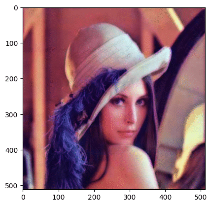

# HomomorphicFiltering_LikeAlbumentations

Implementation of homomorphic filtering as an Albumentations transform for image enhancement and normalization.



## Description

Homomorphic filtering is a frequency domain filtering technique used to:
- Normalize illumination variations in images
- Enhance image contrast
- Simultaneously process multiplicative noise

This repository provides a custom implementation of homomorphic filtering that can be seamlessly integrated into the [Albumentations](https://github.com/albumentations-team/albumentations) image augmentation library.

## How It Works

The homomorphic filtering process consists of the following steps:

1. **Apply logarithmic transform**: Convert the image from spatial domain to frequency domain
2. **Apply high-pass filtering**: Using a Gaussian high-pass filter to reduce low-frequency illumination variations
3. **Apply randomized gamma parameters**: 
   - `gammaH` (high frequency gain): Controls contrast enhancement (random value between 0.5 and 2.0)
   - `gammaL` (low frequency gain): Controls illumination normalization (random value between 0.0 and 1.5)
4. **Apply inverse Fourier transform**: Convert back to spatial domain
5. **Apply exponential transform**: Revert the logarithmic transformation
6. **Normalize and convert to 8-bit**: Ensure output is in the correct format

The filter is applied to each color channel separately, making it effective for both grayscale and color images.

## Installation

```bash
git clone https://github.com/bemoregt/HomomorphicFiltering_LikeAlbumentations.git
cd HomomorphicFiltering_LikeAlbumentations
pip install -r requirements.txt
```

## Dependencies

- NumPy
- OpenCV (cv2)
- Albumentations
- Matplotlib (for visualization)

## Usage

### Basic Example

```python
import cv2
import albumentations as A
from homomorphic_filter import HomomorphicFilter

# Load an image
image = cv2.imread('input_image.jpg')
image = cv2.cvtColor(image, cv2.COLOR_BGR2RGB)  # Convert BGR to RGB

# Create a transform pipeline with HomomorphicFilter
transform = A.Compose([
    HomomorphicFilter(p=1.0),
    # Add other transformations as needed
])

# Apply the transformation
transformed = transform(image=image)
transformed_image = transformed["image"]

# Save the result
cv2.imwrite('output_image.jpg', cv2.cvtColor(transformed_image, cv2.COLOR_RGB2BGR))
```

### Integration with Other Albumentations Transforms

```python
transform = A.Compose([
    A.RandomBrightnessContrast(p=0.3),
    HomomorphicFilter(p=0.7),
    A.HorizontalFlip(p=0.5),
    A.RandomRotate90(p=0.5),
])
```

## Parameters

The `HomomorphicFilter` transform accepts the following parameters:

- `always_apply` (bool): Whether to always apply the transform (default: False)
- `p` (float): Probability of applying the transform (default: 1.0)

The filter itself uses the following internal parameters:

- `sigma` (int): Controls the cutoff frequency of the Gaussian high-pass filter (fixed at 20)
- `gammaH` (float): High-frequency gain, randomly chosen between 0.5 and 2.0
- `gammaL` (float): Low-frequency gain, randomly chosen between 0.0 and 1.5

## Applications

Homomorphic filtering is particularly useful for:

1. **Medical imaging**: Enhancing features in X-rays, MRIs, and microscopy images
2. **Computer vision**: Preprocessing for object detection and recognition
3. **Remote sensing**: Normalizing illumination in satellite and aerial imagery
4. **Face recognition**: Reducing the impact of varying lighting conditions

## License

MIT

## Credits

- [Albumentations](https://github.com/albumentations-team/albumentations) for the image augmentation framework
- Implementation by [bemoregt](https://github.com/bemoregt)
